# Lofo Cinema Website
This is a simple cinema booking website that allows customers to book and pay for their selected seats for the desired movie at selected showtime.

## Features 
- Login/Logout/Signup as a user 
- Login/Logout as an admin 
- Search for movie using genres/searchbar.
- View available showtimes for movies.
- View/select/Book available seats for selected showtime.
- View Upcoming movies.
- Customer can easily contact us and view our about info.
- After logging in customer can view/edit their profile and view their 5 most recent previous booking.
- Logging in validation available
- Admin can Add/Edit/Delete any movie and their related info.
- Customer views total amount after booking and can checkout.

# Screenshots of GUI
- home page before login ,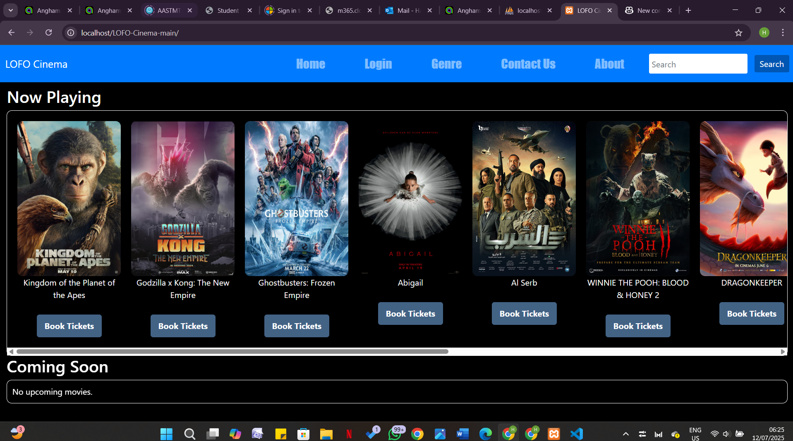
- genre page , 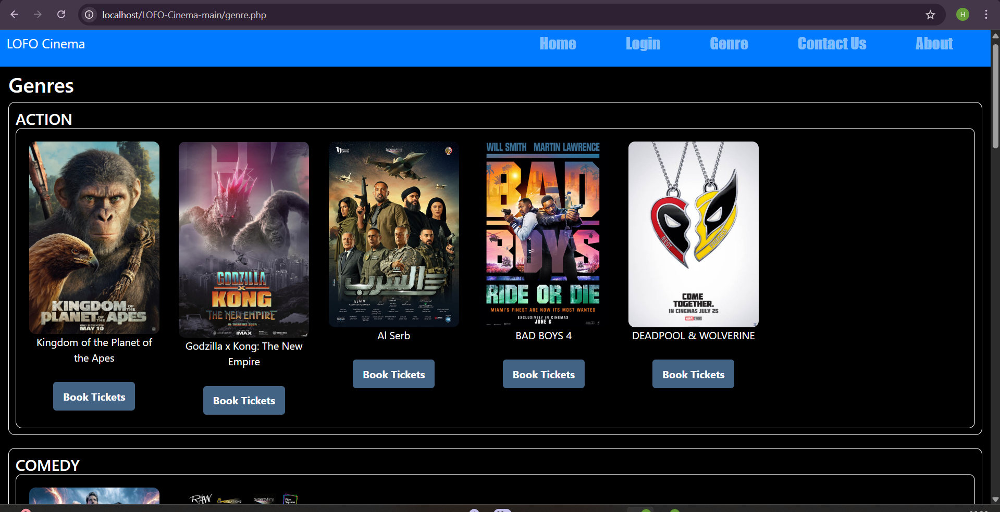
- contact us page, 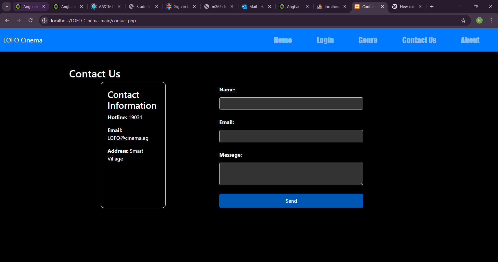
- about page, 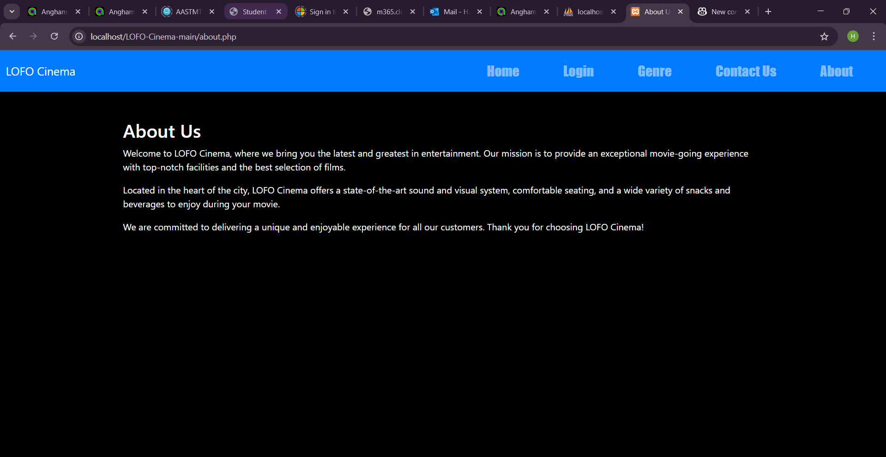
- login page , 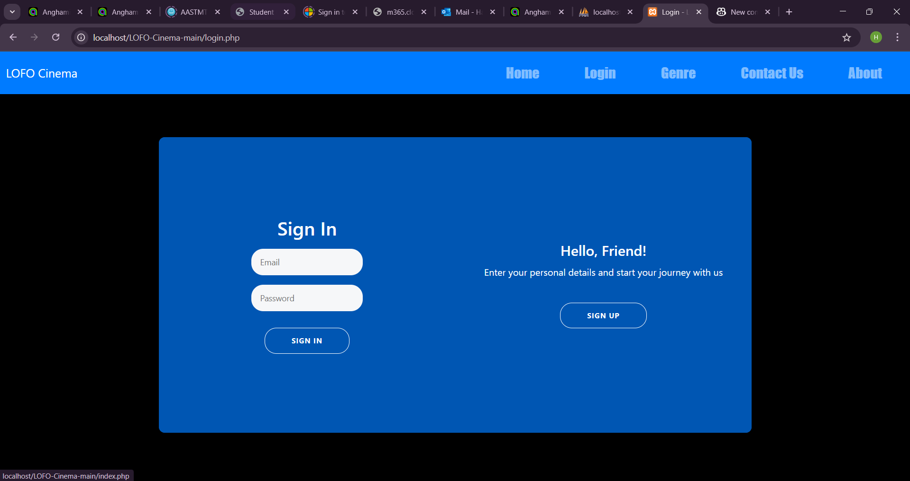
- wrong password error in login, 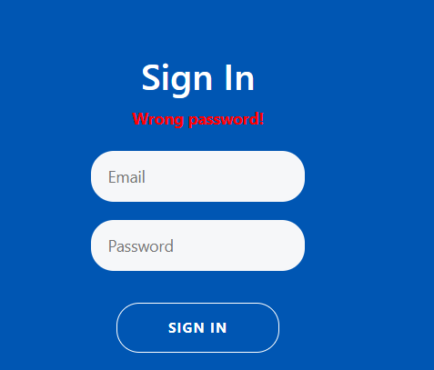 
- nav bar changes after logging in, 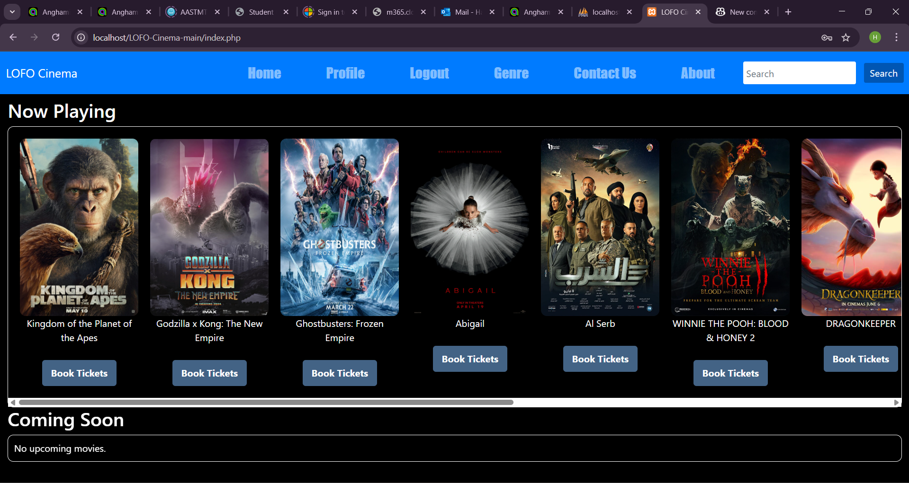
- profile page , 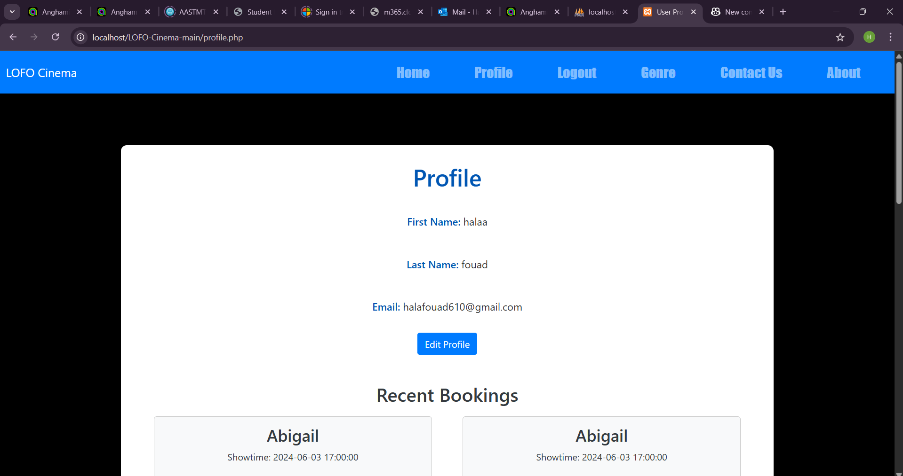
- edit profile option, 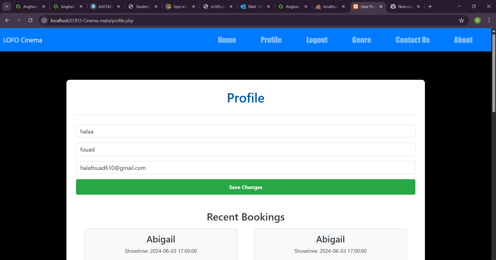
- available showtimes in a combobox, 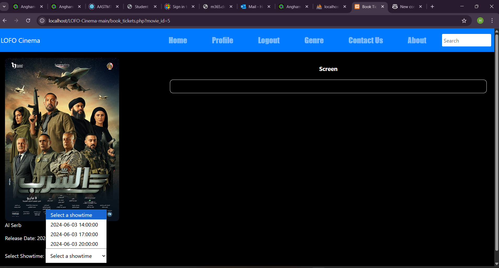
- available seats for selected showtime, 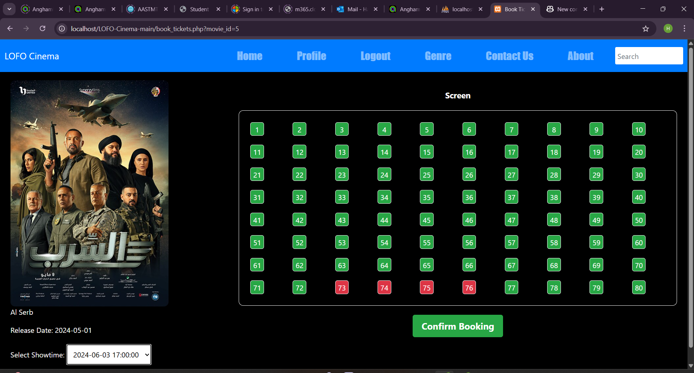
- after selecting seats and clicking on confirm booking, 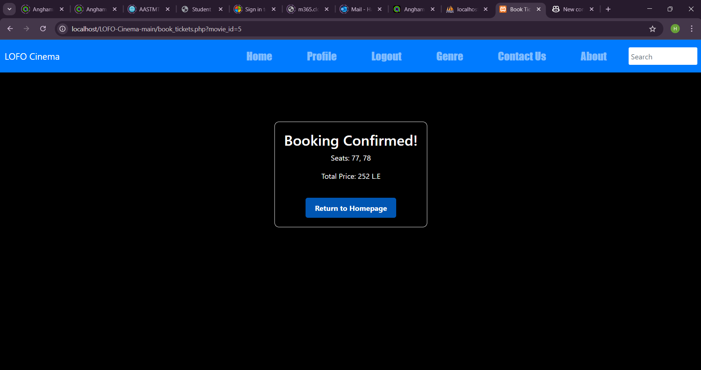

